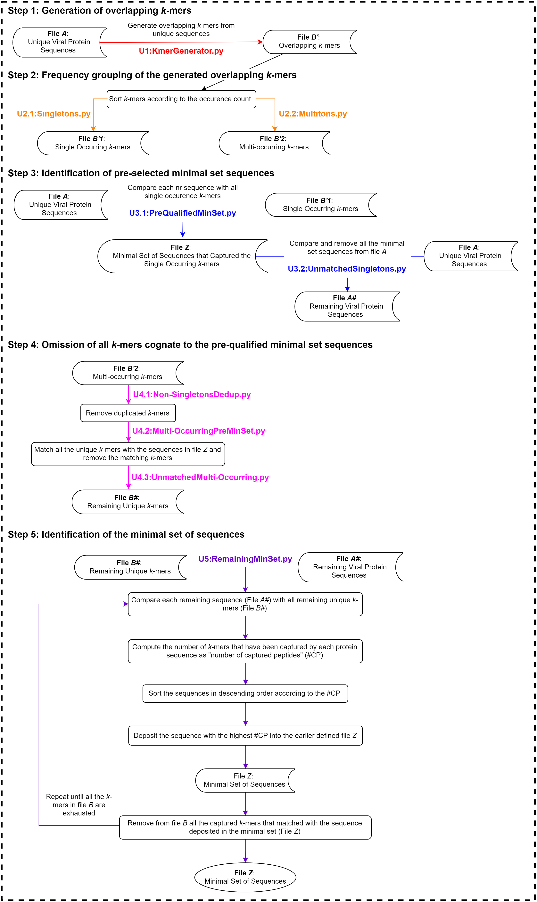

# **UNIQmin: An alignment-independent tool for the study of pathogen sequence diversity at any given rank of taxonomy lineage**

### Brief Description
Sequence variation among pathogens, even of a single amino acid, can expand their host repertoire or enhance the infection ability. Alignment independent approach represents an alternative approach to the study of pathogen diversity, which is devoid of the need for sequence conservation to perform comparative analyses. Herein, we present UNIQmin, a tool that utilises an alignment independent method to generate the minimal set of pathogen sequences, as a way to study their diversity, across any rank of taxonomic lineage. The minimal set refers to the smallest possible number of sequences required to capture the entire repertoire of pathogen peptidome diversity present in a sequence dataset.

Table of Contents
====================
- [Quick Start](#quick-start)
    + [Step 1: Generation of overlapping *k*-mers](#step-1-:-generation-of-overlapping--k--mers)
    + [Step 2: Frequency grouping of the generated overlapping *k*-mers](#step-2--frequency-grouping-of-the-generated-overlapping--k--mers)
    + [Step 3: Identification of pre-selected minimal set of sequences](#step-3--identification-of-pre-selected-minimal-set-of-sequences)
    + [Step 4: Omission of all *k*-mers cognate to the pre-qualified minimal set sequences](#step-4--omission-of-all--k--mers-cognate-to-the-pre-qualified-minimal-set-sequences)
    + [Step 5: Identification of the minimal set of sequences](#step-5--identification-of-the-minimal-set-of-sequences)
- [Figure Summary](#figure-summary)
- [Stitch UNIQmin](#stitch-uniqmin)
- [Citing Resources](#citing-resources)


---
## Quick Start
As with any typical tool, an input file would be required to deliver the output, with user-defined parameters for optimal outcome. The input would be a file containing a set of non-redundant (nr) protein sequences in the FASTA format. Sequences containing the unknown residue, X, may be removed, if desired. Keeping them may result in a minimal set comprising of sequences with the unknown residue.

Below we describe the algorithmic steps of the tool using a sample input file: 

#### Step 1: Generation of overlapping *k*-mers
Use the sample non-redundant (nr) input file (*e.g.* inputfile.fas; referred to as *A*) to generate a set of defined overlapping *k*-mers (e.g. 9-mers; other *k*-mers length can also be defined) from each of the sequences in the input file (the *k*-mer set will be referred to as *B'*), by employing the "U1_KmerGenerator" script.

Note: In the script below, the number of CPU-cores set to be used for Step 1 is 14, which can be modified to user-defined numbers, provided that it is catered by the in-house resources.  
```
from Bio import SeqIO
from concurrent.futures import ProcessPoolExecutor
import math

fileA = list(SeqIO.parse("inputfile.fas","fasta"))
file_id = "Output_kmers.txt"

def generate_kmers(start, end):
	for record in fileA[start:end]:
		nr_sequence = record.seq
		seq_len = len(nr_sequence)
		kmer = 9
		count = 0
		temp = []
		for seq in list(range(seq_len-(kmer-1))):
			count += 1
			my_kmer = (nr_sequence[seq:seq+kmer])
			temp.append(str(my_kmer))
		with open(file_id, 'a') as f:
			f.writelines("%s\n" % kmer for kmer in temp)

if __name__ == '__main__':
  n = len(fileA)
  pool = ProcessPoolExecutor(14)
  futures = []
  perCPUSize = math.ceil(n/14)
  for i in range(0,14):
  	futures.append(pool.submit(generate_kmers, i * perCPUSize, (i+1) * perCPUSize))
```

#### Step 2: Frequency grouping of the generated overlapping *k*-mers
Categorize the overlapping *k*-mers (file *B'*) according to the occurrence (frequency) count

i) All single occurring *k*-mer peptides are deposited into a file (referred to as *B'1*) by use of the "U2.1_Singletons" script. 
```
from Bio import SeqIO
import pandas as pd

kmers = pd.read_csv("Output_kmers.txt", header=None)
kmers.columns = ['kmer']
kmers['freq'] = kmers.groupby('kmer')['kmer'].transform('count')

is_1 = kmers['freq']==1
kmer_1 = kmers[is_1]
singleList = kmer_1['kmer']
singleList.to_csv("seqSingleList.txt", index = False, header = False)
```

ii) All multi-occurring *k*-mer peptides are deposited into a file (referred to as *B'2*) by use of the "U2.2_Multitons" script.
```
import pandas as pd

kmers = pd.read_csv("Output_kmers.txt", header=None)
kmers.columns = ['kmer']
kmers['freq'] = kmers.groupby('kmer')['kmer'].transform('count')

more1 = kmers['freq']!=1
more1.head()
kmer_more1 = kmers[more1]
more1List = kmer_more1['kmer']
more1List.to_csv("seqmore1List.txt", index = False, header = False)
```

#### Step 3: Identification of pre-selected minimal set sequences
i) Match all the single occurring *k*-mer peptides of *B'1* and all sequences of *A* to identify the sequences that captured each of the *k*-mer peptides, and such sequences of *A* are then subsequently deposited into a minimal set file, *Z*. This step is carried out by use of the "U3.1_PreQualifiedMinSet" script. 
```
from Bio import SeqIO
import ahocorasick
import logging

def load_data(fasta_file, kmer_file):
    logging.info("Loading fasta file")
    fasta_list = list(SeqIO.parse(fasta_file,"fasta"))
    logging.info("Loading kmer list")
    kmer_list = [line.rstrip('\n') for line in open(kmer_file)]
    return fasta_list, kmer_list

def find_match(line, A):
    found_kmers = []
    for end_index, kmer in A.iter(line):
        found_kmers.append(kmer)
    return found_kmers

def setup_automaton(kmer_list):
    logging.info("Setting up kmer lookup")
    auto = ahocorasick.Automaton()
    for seq in kmer_list:
        auto.add_word(seq, seq)
    auto.make_automaton()
    logging.info("Completed set-up of kmer lookup")
    return auto

def match_kmers(fasta_list, kmer_auto):
    logging.info("Writing output")
    with open(output_file,"w") as f:
        for record in fasta_list:
            match = find_match(str(record.seq), kmer_auto)
            if match:
                line = record.id + "\n"
                f.write(line)
    logging.info("Completed")

if __name__ == '__main__':
    fasta_file = "inputfile.fas"
    kmer_file = "seqSingleList.txt"
    output_file = "seqfileZ.txt"

    logging.basicConfig(format='%(asctime)s - %(message)s', level=logging.INFO)

    fasta_list, kmer_list = load_data(fasta_file, kmer_file)
    kmer_auto = setup_automaton(kmer_list)
    match_kmers(fasta_list, kmer_auto)
```

ii) Remove the sequences deposited into *Z* from file *A*, and thus, resulting in a new file, containing only the remaining sequences, referred to as *A#*. This step is carried out by use of the "U3.2_UnmatchedSingletons" script.
```
from Bio import SeqIO

fileA = list(SeqIO.parse("inputfile.fas","fasta"))
header_set = set(line.strip() for line in open("seqfileZ.txt"))
remainingSeq = open("remainingSeq.fasta","w")

for seq_record in fileA:
	try:
		header_set.remove(seq_record.name)
	except KeyError:
		remainingSeq.write(seq_record.format("fasta"))
remainingSeq.close()

fasta_file = "inputfile.fas" 
wanted_file = "seqfileZ.txt" 
result_file = "result_file.fasta" 

wanted = set()
with open(wanted_file) as f:
	for line in f:
		line = line.strip()
		if line != "":
			wanted.add(line)

fasta_sequences = SeqIO.parse(open(fasta_file),'fasta')
with open(result_file, "w") as f:
	for seq in fasta_sequences:
		if seq.id in wanted:
			SeqIO.write([seq], f, "fasta")
```

#### Step 4: Omission of all *k*-mers cognate to the pre-qualified minimal set sequences
i) Remove the duplicates among the multi-occurring *k*-mer peptides in file *B'2*, which would result in a file comprising only a single copy of the multi-occurring *k*-mer peptides. This step is carried out by use of the "U4.1_Non-SingletonsDedup" script. 
```
lines_seen = set()
outfile = open("nr_more1List.txt","w")
for line in open("seqmore1List.txt","r"):
	if line not in lines_seen:
		outfile.write(line)
		lines_seen.add(line)
outfile.close()
```

ii) Identify the unique, multi-occurring *k*-mers that matched the pre-qualified minimal set sequences in *Z*. This step is carried out by use of the "U4.2_Multi-OccurringPreMinSet" script.
```
from Bio import SeqIO
import ahocorasick
import logging 

def load_data(fasta_file, kmer_file):
	logging.info("Loading fasta file")
	fasta_list = list(SeqIO.parse(fasta_file,"fasta"))
	logging.info("Loading kmer list")
	kmer_list = [line.rstrip('\n') for line in open (kmer_file)]
	return fasta_list, kmer_list

def find_match(line, A):
	found_kmers = []
	for end_index, kmer in A.iter(line):
		found_kmers.append(kmer)
	return found_kmers

def setup_automaton(kmer_list):
	logging.info("Setting up kmer lookup")
	auto = ahocorasick.Automaton()
	for seq in kmer_list:
		auto.add_word(seq, seq)
	auto.make_automaton()
	logging.info("Completed set-up of kmer lookup")
	return auto 

def match_kmers(fasta_list, kmer_auto):
	logging.info("Writing output")
	with open(output_file, "w") as f:
		for record in fasta_list:
			match = find_match(str(record.seq), kmer_auto)
			if match:
				line = str(match) + "\n"
				f.write(line)
	logging.info("Completed")

if __name__ == '__main__':
	fasta_file = "result_file.fasta"
	kmer_file = "nr_more1List.txt"
	output_file = "matchKmer4CleanKmer.txt"

	logging.basicConfig(format='%(asctime)s - %(message)s', level=logging.INFO)
	
	fasta_list, kmer_list = load_data(fasta_file, kmer_file)
	kmer_auto = setup_automaton(kmer_list)
	match_kmers(fasta_list, kmer_auto)
```

iii) Remove the matched unique, multi-occurring *k*-mer peptides, which would result in a new file (referred to as *B#*). This step is carried out by use of the "U4.3_UnmatchedMulti-Occurring" script. 
```
import ast
import itertools

listOfLines = list()        
with open ("matchKmer4CleanKmer.txt", "r") as myfile:
  for line in myfile:
    line = ast.literal_eval(line)
    listOfLines.append(line) 

full_list = list(itertools.chain(*listOfLines))

with open("fullList.txt",'w') as f:
  for item in full_list:
    f.write("%s\n" % item)

lines_seen = set()
nr_lines = open("Clean_lines.txt", "w")
for line in open("fullList.txt","r"):
	if line not in lines_seen:
		nr_lines.write(line)
		lines_seen.add(line)
nr_lines.close()

a = open("nr_more1List.txt", 'r')
b = open("Clean_lines.txt", 'r')
result = "remainingKmer.txt"

remain_kmer_list = list(set(a) - set(b))
with open(result, "w") as f: 
  for i in remain_kmer_list:
    f.write(i)
```

#### Step 5: Identification of the minimal set of sequences
Match between the remaining unique, multi-occurring *k*-mers of *B#* and the remaining sequence of *A#*, and subsequently, identify the sequence with the maximal *k*-mers coverage, which are then deposited into the earlier defined file *Z* (minimal set). The deposited sequences in file *Z* and their inherent *k*-mers are removed from file *A#* and file *B#*, respectively. This process is repeated until the *k*-mers in the file *B#* are exhausted. This step is carried out by use of the "U5_RemainingMinSet" script. 
```
from Bio import SeqIO
import pandas as pd 
import ahocorasick as ahc

remain_Seq = list(SeqIO.parse("remainingSeq.fasta","fasta"))
remain_kmer = [line.rstrip('\n') for line in open ("remainingKmer.txt")]

def make_automaton(kmer_list):
    A = ahc.Automaton()  
    for kmer in kmer_list:
        A.add_word(kmer, kmer)
    A.make_automaton() 
    return A

def find_matching(line, A):
    found_kmers = []
    for end_index, kmer in A.iter(str(line)):
        found_kmers.append(kmer)
    return found_kmers

a = 0

while(len(remain_kmer) != 0):
    
    A = make_automaton(remain_kmer)
    
    matching_file = 'match/matching'+str(a)
    remain_kmer_file = 'match/remain_kmer'+str(a)
    
    # save matching to file
    with open(matching_file, 'w') as f:
        for index in range(len(remain_Seq)):
            x = remain_Seq[index].id
            y = find_matching(remain_Seq[index].seq, A)
            z = len(y)
            f.write(x + ';' + str(y) + ';' + str(z) + '\n')
    
    # read matching file and sorted by descending & some cleaning
    df = pd.read_csv(matching_file, delimiter=';', names=['sequence_id', 'matched_kmer', 'count']).sort_values(by='count',ascending=False, kind='mergesort')
    df['matched_kmer'] = df['matched_kmer'].str.replace(r"\[|\]|'","")
    
    # save highest count id to file
    fileZ = open('fileZ.txt', 'a')
    fileZ.write(df['sequence_id'].iloc[0] + '\n')
    
    # remove highest count kmer
    kmer_to_remove = df['matched_kmer'].iloc[0].split(', ')
    remain_kmer = list(set(remain_kmer) - set(kmer_to_remove))
    
    # save remain kmer to file
    with open(remain_kmer_file, 'w') as f:
     for i in remain_kmer:
         f.write(i + '\n')
         
    a = a + 1
```
---
## Figure Summary


---
## Stitch UNIQmin
```
#!/bin/bash
#$ -V

dir=/backup/user/ext/perdana/lichuin/cdhitObj2/testingStitchScript/ #path of your directory
cd $dir
python p1.py
wait 
python p2.py
wait
python p2_2.py
wait
python p3.py
wait 
python p3_2.py
wait 
python p4_1.py
wait 
python p4_2.py
wait 
python p4_3.py
wait
cp seqfileZ.txt fileZ.txt
mkdir match
wait 
python p5.py
```

---
## Citing Resources
